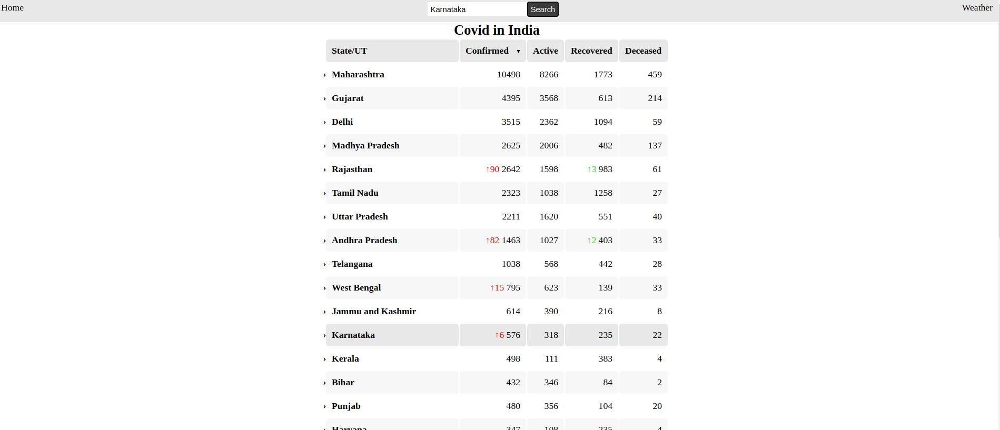
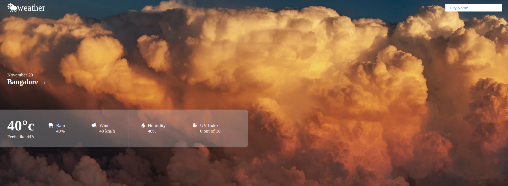
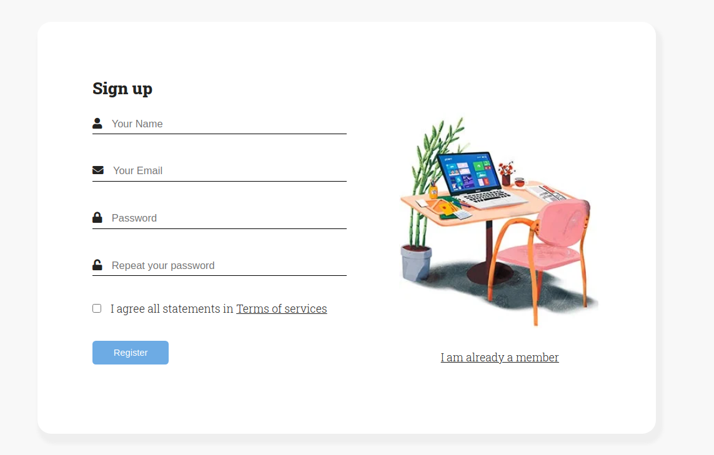
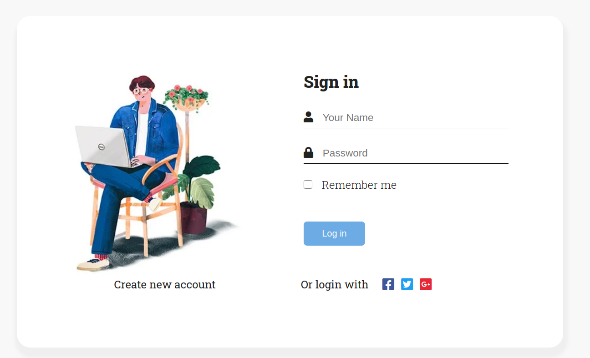

# Basidia-assignment
A simple web app assignment from [Basidia learning pvt ltd]('https://www.basidialearning.com/')

Table of contents

----------------------------

1. [About The Project]('#about-the-project')
    * [Built With]('#built-with')
1. [The Homepage]('#the-homepage')
1. [Weather Api]('#weather-api')
1. [Authentication]('#authentication') 
1. [Contact]('#contact')    
1. [Acknowledgement]('#acknowledgement')    

-----------------------------------
## About The Project
The objective of this assignment was to create a web app with a homepage where the latest coronavirus data is showed in a table and a weather route where users can check the weather forcast of any city in the world.

### Built With
The app was built with the following stack

* FrontEnd
    * HTML
    * CSS
    * Javascript
* Backend
    * Node
    * Express
    * Other npm packages
* Database
    * Googlesheets Api       

## The Homepage

The homepage displays the Coronavirus data for India and the information for it is being fetched from the data.csv file with the help of **fetch api**. Also, when search for the details of a perticular state, the data of that state gets highlighted.

## Weather Api

This section of the app shows the weather data of any city in the world. The data for it is being ontained from [weather api]('https://rapidapi.com/marketplace')

## Authentication

The user info is stored in googlesheets and accessed using the googlesheets api for authentication.

## Contact
Linkedin: [Karthik S P]('https://www.linkedin.com/in/karthik-s-p-%F0%9F%87%AE%F0%9F%87%B3-931345122/')

Portfolio: <http://www.karthiksp.in/>

## Acknowledgement
* [Basidia learning pvt ltd]('https://www.basidialearning.com/')

